# 🚀 Multi API Serverless ETL Pipeline

<p align="center">
  An event-driven serverless ETL pipeline built on AWS that automatically processes data from multiple public APIs using Amazon S3, AWS Lambda, and Amazon DynamoDB.
</p>

<p align="center">
  
  
  
  
</p>
<p align="center">
  
  
</p>

---

| Project | Multi API Serverless ETL Pipeline |
|----------|----------------------------------|
| Language | Python 3.13 |
| Architecture | Event-Driven Serverless ETL |
| Cloud Services | Amazon S3, AWS Lambda, DynamoDB, CloudWatch |
| CI/CD | GitHub Actions |

---
## 🏗️ Architecture Overview

The following diagram illustrates the complete event-driven ETL workflow implemented in this project.

                 +----------------------+
                 |     Public APIs      |
                 +----------------------+
                           |
                           v
                 +----------------------+
                 |    Fetch Scripts     |
                 +----------------------+
                           |
                           v
                 +----------------------+
                 |      Amazon S3       |
                 +----------------------+
                           |
                           v
                 +----------------------+
                 |    Router Lambda     |
                 +----------------------+
                   /      |      |      \
                  /       |      |       \
                 v        v      v        v
        +-----------+ +-----------+ +-----------+ +-----------+
        | Weather   | |Earthquake | | Product   | | Transit   |
        |  Lambda   | |  Lambda   | |  Lambda   | |  Lambda   |
        +-----------+ +-----------+ +-----------+ +-----------+
             |              |              |              |
             v              v              v              v
      +------------+ +------------+ +------------+ +------------+
      | Weather    | |Earthquake  | | Product    | | Transit    |
      | DynamoDB   | | DynamoDB   | | DynamoDB   | | DynamoDB   |
      +------------+ +------------+ +------------+ +------------+
      
### Architecture Summary

- Python scripts collect data from multiple public APIs.
- Raw JSON files are uploaded to Amazon S3.
- Amazon S3 triggers the Router Lambda using an ObjectCreated event.
- The Router Lambda invokes the appropriate processing Lambda based on the uploaded dataset.
- Each Lambda validates and transforms the data before storing it in its corresponding DynamoDB table.
- Amazon CloudWatch records execution logs for monitoring and debugging.
---

# 📖 Project Overview

This project demonstrates a **multi-source event-driven ETL (Extract, Transform, Load) pipeline** built on AWS.

Data is collected from four public APIs (Weather, Earthquake, Product, and Transit) using Python fetch scripts. The generated JSON files are uploaded to Amazon S3, where an `ObjectCreated` event automatically triggers a Router Lambda.

The Router Lambda identifies the uploaded dataset and invokes the corresponding processing Lambda. Each Lambda validates, transforms, and stores the processed data into its dedicated Amazon DynamoDB table. Execution logs are captured in Amazon CloudWatch for monitoring and debugging.

The project follows a modular architecture, making it easy to maintain and extend with additional data sources.

---

## ✨ Features

- Event-driven serverless ETL architecture
- Integration with four public APIs
- Automatic processing using Amazon S3 event notifications
- Router Lambda for dynamic dataset routing
- Dedicated Lambda function for each dataset
- Shared utility modules for reusable code
- Automatic data validation and transformation
- Structured storage using Amazon DynamoDB
- Centralized monitoring with Amazon CloudWatch
- Automated deployment using GitHub Actions

---

## ⚙️ Workflow

```text
Public APIs
     │
     ▼
Python Fetch Scripts
     │
     ▼
Amazon S3 Bucket
     │
     ▼
ObjectCreated Event
     │
     ▼
Router Lambda
     │
┌────┼────────┬────────┐
▼    ▼        ▼        ▼
Weather  Earthquake  Product  Transit
Lambda    Lambda     Lambda   Lambda
│          │          │        │
▼          ▼          ▼        ▼
Weather    Earthquake Product  Transit
Table      Table      Table    Table
     │
     ▼
Amazon CloudWatch
```
---

# ☁️ AWS Services Used

| AWS Service | Purpose |
|-------------|---------|
| **Amazon S3** | Stores raw JSON files fetched from public APIs |
| **AWS Lambda** | Processes uploaded datasets and performs ETL operations |
| **Amazon DynamoDB** | Stores transformed data for each dataset |
| **Amazon CloudWatch** | Captures execution logs and monitors Lambda functions |
| **AWS IAM** | Manages permissions for AWS resources |
| **GitHub Actions** | Automates CI/CD workflow for the project |

---

# 📁 Project Structure

```text
multi-api-serverless-etl/
│
├── .github/
│   └── workflows/
│       └── ci.yml
│
├── lambdas/
│   ├── router/
│   ├── weather/
│   ├── earthquake/
│   ├── product/
│   └── transit/
│
├── scripts/
│   ├── fetch_weather.py
│   ├── fetch_earthquake.py
│   ├── fetch_product.py
│   └── fetch_transit.py
│
├── shared/
│   ├── aws_clients.py
│   ├── config.py
│   ├── dynamodb_helper.py
│   ├── logger.py
│   ├── responses.py
│   ├── s3_helper.py
│   └── validators.py
│
├── docs/
│   └── screenshots/
│
├── tests/
│
├── requirements.txt
├── buildspec.yml
└── README.md
```
---

# 📸 Project Screenshots

## Amazon S3 Bucket

Raw JSON files uploaded to the S3 bucket trigger the event-driven ETL pipeline.

<p align="center">
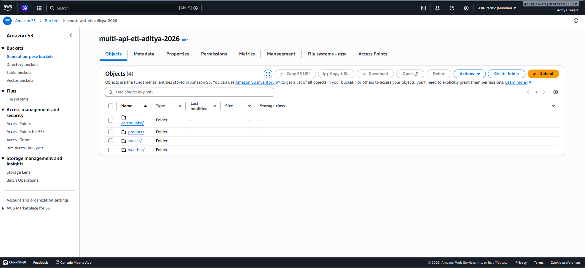
</p>

---

## AWS Lambda Functions

All Lambda functions deployed for routing and processing different datasets.

<p align="center">
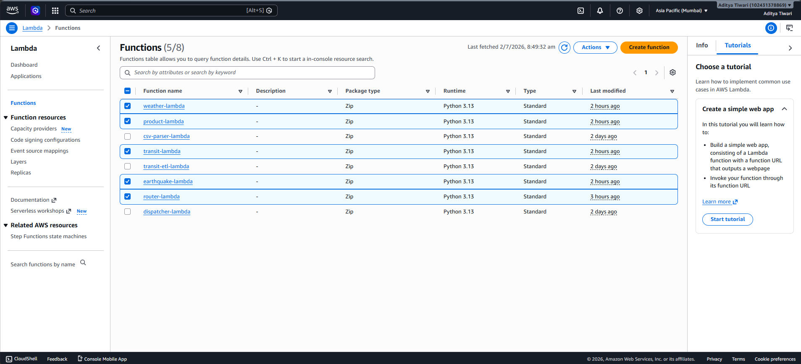
</p>

---

## Router Lambda

The Router Lambda identifies the uploaded dataset and invokes the corresponding processing Lambda.

<p align="center">
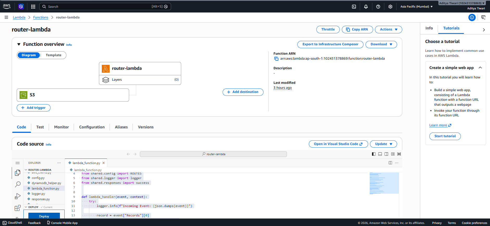
</p>

---

## 🌦 Weather Pipeline

Weather data successfully processed and stored in the Weather DynamoDB table.

| CloudWatch Logs | DynamoDB |
|-----------------|----------|
| 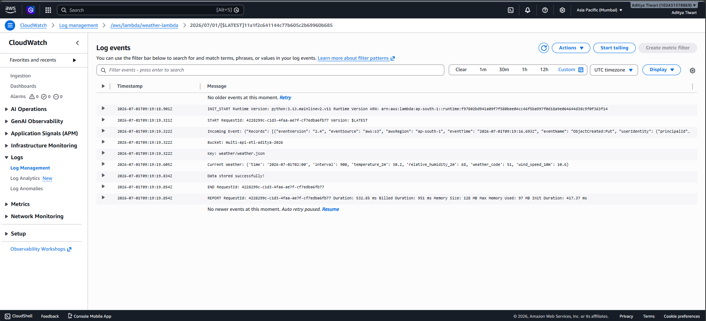 | 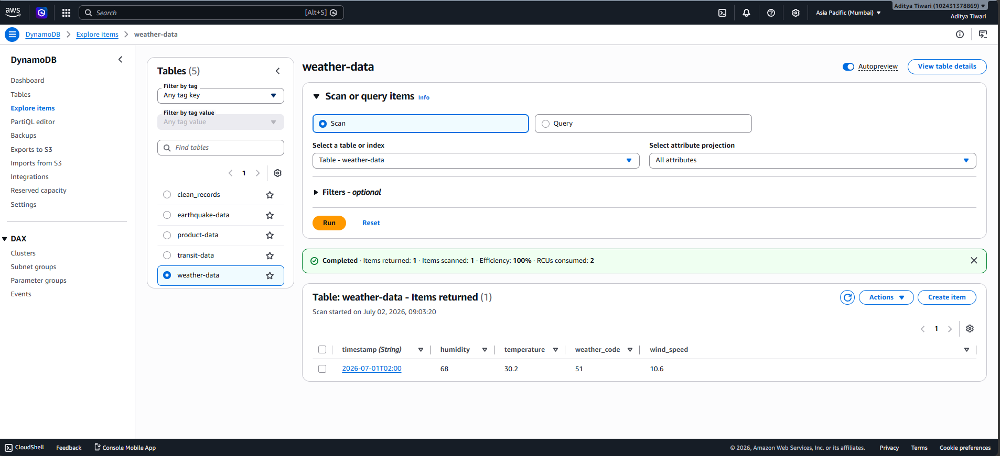 |

---

## 🌍 Earthquake Pipeline

Earthquake data processed from the public API and stored in DynamoDB.

| CloudWatch Logs | DynamoDB |
|-----------------|----------|
| 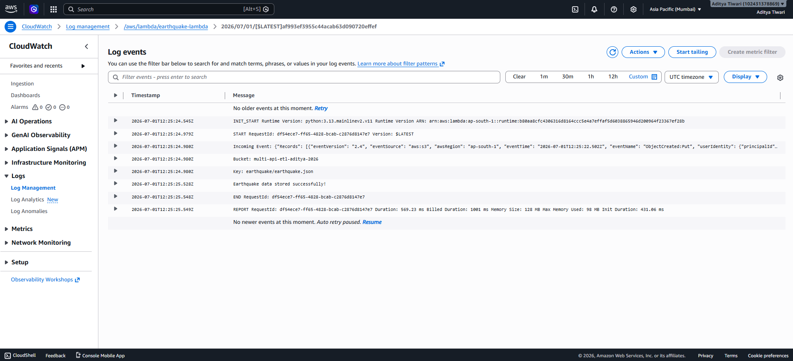 | 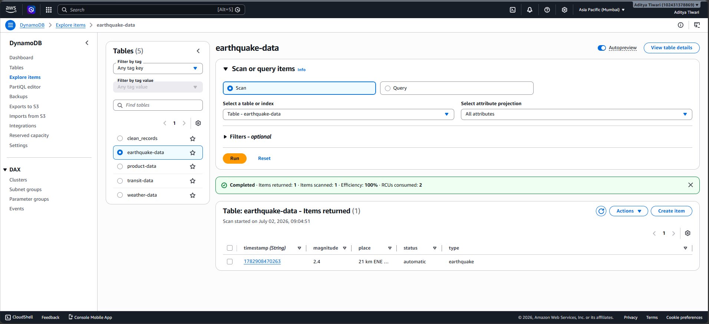 |

---

## 🛒 Product Pipeline

Product dataset transformed and stored successfully in DynamoDB.

| CloudWatch Logs | DynamoDB |
|-----------------|----------|
| 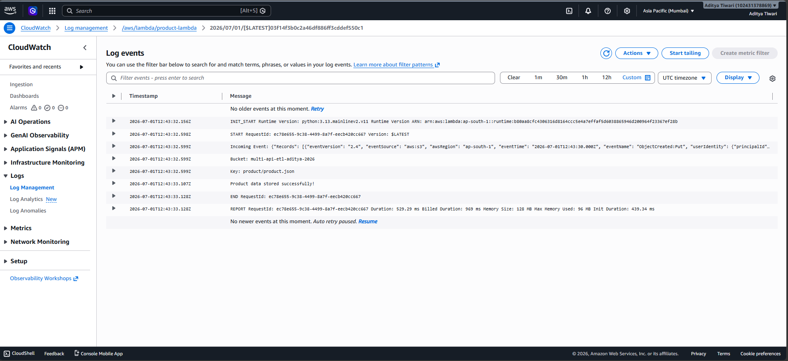 | 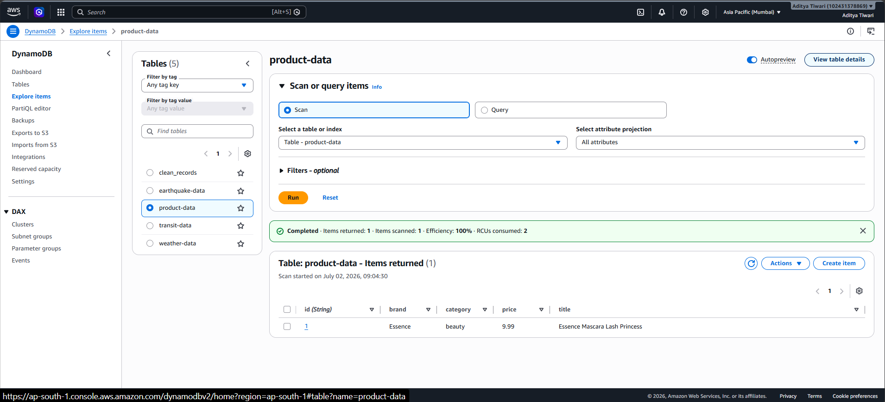 |

---

## 🚌 Transit Pipeline

Transit records processed automatically and stored in DynamoDB.

| CloudWatch Logs | DynamoDB |
|-----------------|----------|
| 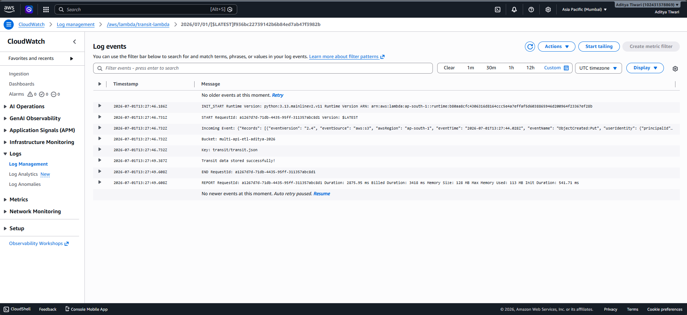 | 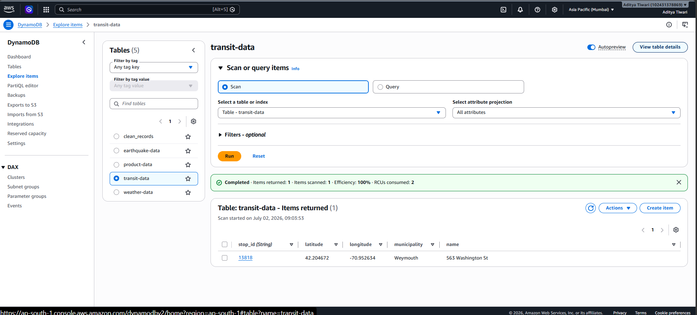 |

---

## GitHub Repository

Complete source code hosted on GitHub.

<p align="center">
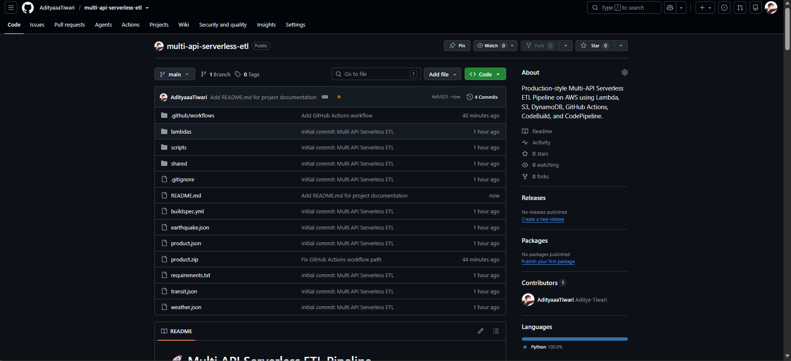
</p>

---

## GitHub Actions

Continuous Integration workflow validating every push to the repository.

<p align="center">
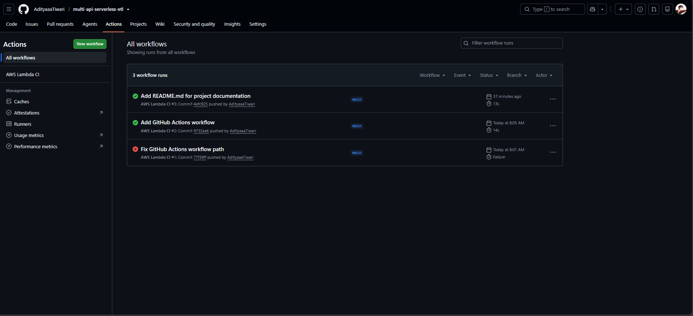
</p>

---
## GitHub Repository

Project source code hosted on GitHub.

<p align="center">

</p>

---

# ▶️ Running Locally

### Clone the repository

```bash
git clone https://github.com/AdityaaaTiwari/multi-api-serverless-etl.git
```

### Navigate to the project directory

```bash
cd multi-api-serverless-etl
```

### Install dependencies

```bash
pip install -r requirements.txt
```

### Configure AWS CLI

```bash
aws configure
```

Provide your:
- AWS Access Key ID
- AWS Secret Access Key
- Default Region (for example: `ap-south-1`)
- Output Format (`json`)

### Run the fetch scripts

```bash
python scripts/fetch_weather.py
python scripts/fetch_earthquake.py
python scripts/fetch_product.py
python scripts/fetch_transit.py
```

### Upload JSON files to Amazon S3

The uploaded files automatically trigger the Router Lambda, which invokes the corresponding processing Lambda.

### Verify the pipeline

- Check Amazon CloudWatch Logs for execution details.
- Verify processed records in the corresponding Amazon DynamoDB tables.

> **Note:** This project follows an event-driven architecture. No manual Lambda execution is required after uploading files to Amazon S3.

---

# 🚀 Future Improvements

- Add Amazon API Gateway to expose processed data through REST APIs.
- Integrate Amazon SNS for event notifications.
- Deploy infrastructure using Terraform or AWS CloudFormation.
- Add automated unit and integration testing.
- Support additional public APIs with minimal configuration.
- Improve monitoring with Amazon CloudWatch Dashboards and Alarms.
---

# 👤 Author

**Aditya Tiwari**

B.Tech Computer Science Engineering

- **GitHub:** (https://github.com/AdityaaaTiwari)
- **LinkedIn:** (https://www.linkedin.com/in/aditya-tiwari-a99739342/)

If you found this project helpful, consider giving it a ⭐ on GitHub. Your support is appreciated!